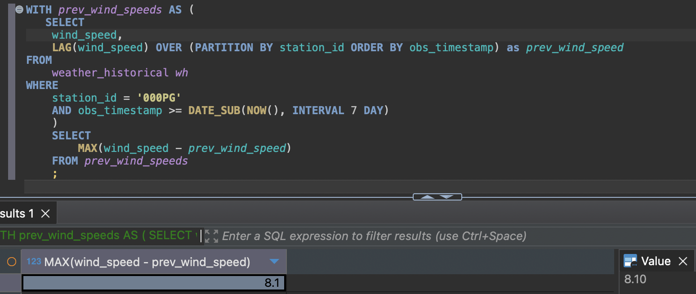

# Weather historical data ETL 
This documentation provides a guide on how to set up and run the Weather ETL pipeline using Docker Compose.

### Structure

The main file is the `pipeline.py` file. The code for the Extraction, transformation and load of data can be found in the [etl/](etl/) directory.

At a high level, the structure of this repository is:

```
weather-history-pipeline/
│
├── etl/
│   ├── extract_step.py
│   ├── transform_step.py
│   └── load_step.py
├── metrics_sql_queries/
│   ├── avg_temperature.sql
│   ├── max_wind_speed_change.sql
│
├── pipeline.py
└── README.md
└── docker-files
```

### Prerequisites
Docker: Ensure Docker is installed on your machine.

Docker Compose: Ensure Docker Compose is installed.

Using the docker desktop is highly recommended as it is quite intuitive. But it is not a requirement.

### Running the Pipeline
Make sure to start a terminal located in the root directory of this project. This will be in **weather-history-pipeline/**

Build the Docker Images:

```docker-compose build```

Start the Docker Containers:

```docker-compose up```

Check the Logs:

```docker logs weather-pipeline```

These commands will spin up the database container (mysql_db) and the pipeline container (weather-pipeline). The pipeline container will execute the pipeline once and then turn off. To re-run it, just re-start the pipeline container.

Example logs of multiple runs


If using the docker desktop, you can hit the start button with the container selected to re-run the pipeline container


## Results
The pipeline will create and populate the table `weather-historical` in the database `weather-forecast`


As per the last run of the queries, executed on the morning of Monday October 7th.
### Average observed temperature for last week(Mon-Sun). 
Result = 26.899083


### Maximum wind speed change between two consecutive observations in the last 7 days.
Result = 8.1



### Queries
The queries required to find the average observed temperature and maximum wind speed change can be found in the `metrics_sql_queries/` directory. 

[Avg temperature](metrics_sql_queries/avg_temperature.sql)

[Max wind speed change](metrics_sql_queries/max_wind_speed_change.sql)


## Disclaimers
The station ID picked is `000PG`, but this is a parameter of the pipeline and can be modified in the envirorment variables of the docker-compose.yml file. The envirorment variable is `- STATION_ID=000PG`

The creation of the table was included in the ETL pipeline, but this logic could be also decoupled from the pipeline if required. The table creation could be set up on database creation using a init_db script, which could be beneficial to have a separation of concerns and not having schema creation logic in the pipeline. 

Logs are set to INFO level, but this is a parameter as well and can be set in the docker-compose.yml file. The env variable is `- LOG_LEVEL=INFO `